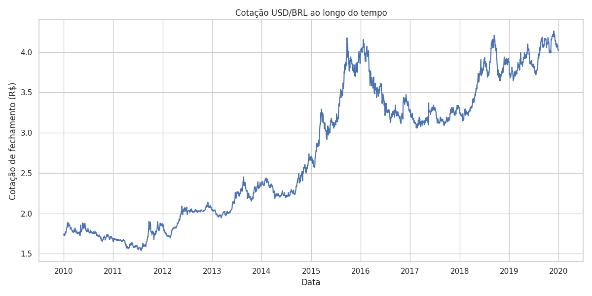
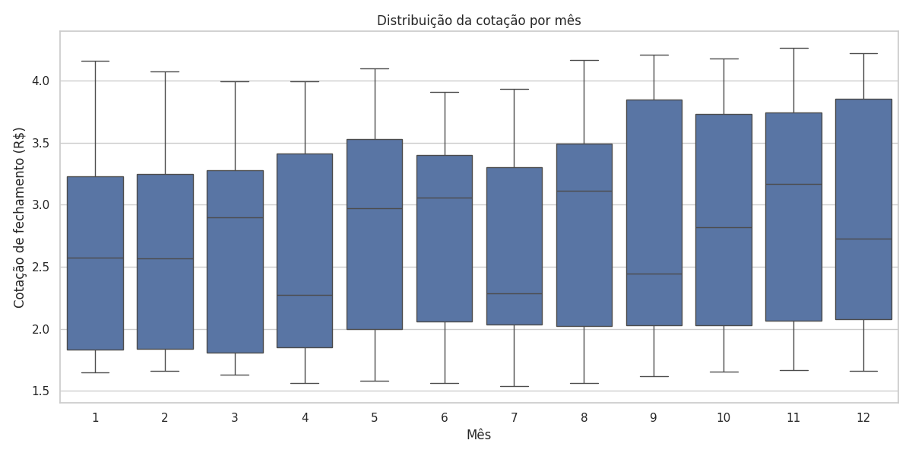
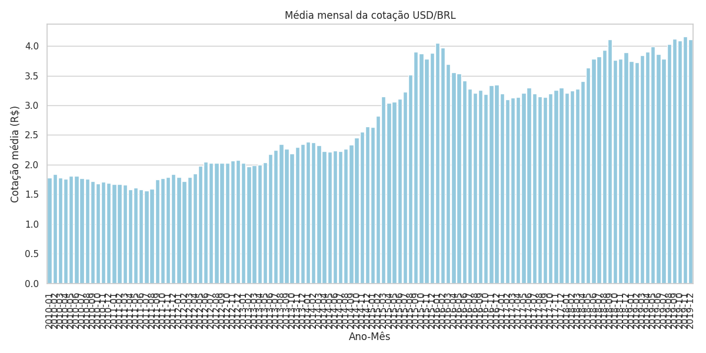

# projeto_python_data_analise
projeto_python_analise-cotacao-usd-brl

# Análise da Cotação Histórica USD/BRL

## Descrição do Projeto

Este projeto realiza uma análise da série histórica da taxa de câmbio entre o Dólar Americano (USD) e o Real Brasileiro (BRL). Utilizando Python e as bibliotecas Pandas, Matplotlib e Seaborn, o projeto carrega os dados, realiza tratamentos e gera três visualizações distintas para entender diferentes aspectos do comportamento da cotação ao longo do tempo.

## Conteúdo do Repositório

* `data_analise_pythoncode.ipynb` (ou `.py`): O notebook/script Python contendo todo o código para carregamento, tratamento dos dados e geração dos gráficos.
* `USD_BRL_hist.csv`: O arquivo de dados utilizado na análise (se incluído diretamente no repositório).
* `grafico1_evolucao.png`: Gráfico de linha mostrando a evolução da cotação USD/BRL ao longo do tempo.
* `grafico2_boxplot.png`: Boxplot mostrando a distribuição da cotação por mês.
* `grafico3_media_mensal.png`: Gráfico de barras mostrando a média mensal da cotação USD/BRL.
* `README.md`: Este arquivo, com a descrição do projeto.

## Tecnologias Utilizadas

* Python 3.x
* Pandas
* Matplotlib
* Seaborn
* Jupyter Notebook (se estiver usando `.ipynb`)

## Como Executar/Visualizar

1.  **Instale as dependências:**
    Certifique-se de ter Python instalado. Você pode instalar as bibliotecas necessárias usando pip:
    ```bash
    pip install pandas matplotlib seaborn jupyter
    ```
2.  **Abra o Notebook/Execute o Script:**
    * Se for um Jupyter Notebook (`.ipynb`):
        ```bash
        jupyter notebook data_analise_pythoncode.ipynb
        ```
    Os gráficos serão exibidos e salvos na pasta do projeto.

## Gráficos Gerados

O projeto gera três visualizações principais:

1.  **Evolução da Cotação USD/BRL:**
    * Um gráfico de linha que demonstra a tendência da taxa de câmbio ao longo do período analisado.
    * 

2.  **Distribuição da Cotação por Mês:**
    * Um boxplot que ilustra a variação e a mediana da cotação para cada mês do ano, permitindo identificar padrões sazonais.
    * 

3.  **Média Mensal da Cotação USD/BRL:**
    * Um gráfico de barras que apresenta a cotação média para cada combinação de ano e mês, facilitando a comparação entre períodos específicos.
    * 

---
